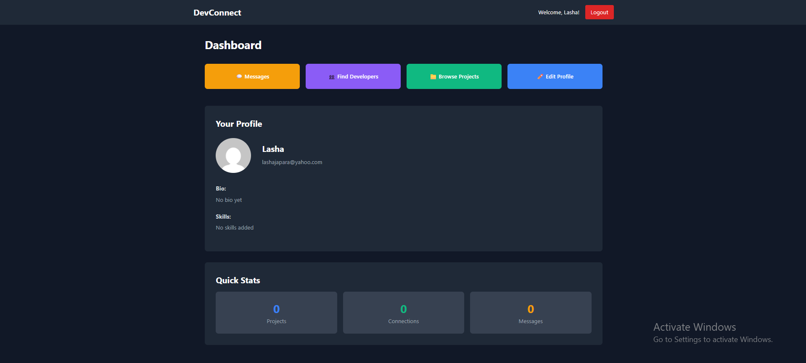
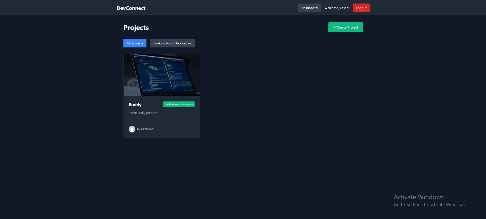
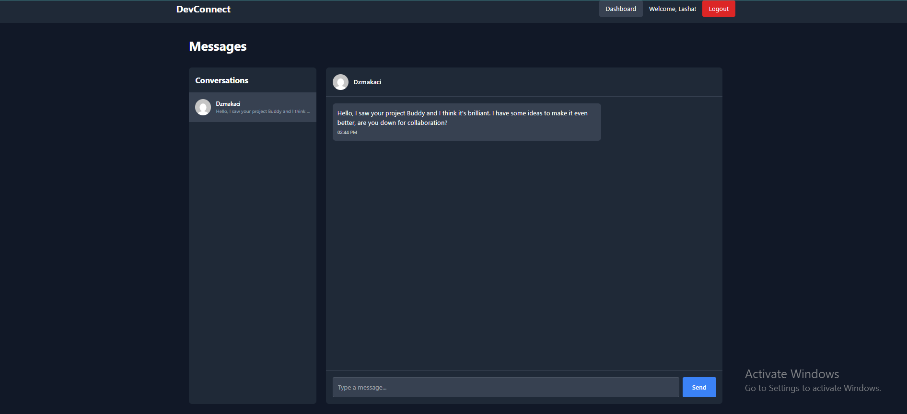

# DevConnect - Developer Networking Platform

A full-stack web application that connects developers, enabling them to showcase projects, discover collaborators, and communicate in real-time.

**Live Demo:** [https://devconnect-ashen.vercel.app](https://devconnect-ashen.vercel.app)

## 📸 Screenshots





## Features

-  **Secure Authentication** - JWT-based user registration and login
-  **User Profiles** - Customizable profiles with bio, skills, and GitHub integration
-  **Project Showcase** - Create, browse, and manage development projects
-  **Developer Discovery** - Search and filter developers by skills and interests
-  **Real-Time Chat** - Live messaging with Socket.io and typing indicators
-  **Modern UI** - Clean, responsive dark-themed interface
-  **Collaboration** - Mark projects as "Looking for Collaborators"

## Tech Stack

### Frontend
- **React** - UI library
- **Vite** - Build tool
- **React Router** - Navigation
- **Axios** - HTTP client
- **Socket.io Client** - Real-time communication

### Backend
- **Node.js** - Runtime environment
- **Express** - Web framework
- **MongoDB** - Database
- **Mongoose** - ODM
- **Socket.io** - WebSocket library
- **JWT** - Authentication
- **bcryptjs** - Password hashing

### Deployment
- **Frontend:** Vercel
- **Backend:** Render
- **Database:** MongoDB Atlas

## Getting Started

### Prerequisites
- Node.js (v18 or higher)
- MongoDB Atlas account
- Git

### Installation

1. **Clone the repository**
```bash
git clone https://github.com/YOUR_USERNAME/devconnect.git
cd devconnect
```

2. **Install dependencies**

Backend:
```bash
cd server
npm install
```

Frontend:
```bash
cd client
npm install
```

3. **Environment Variables**

Create `server/.env`:
```env
PORT=5000
MONGO_URI=your_mongodb_connection_string
JWT_SECRET=your_jwt_secret_key
NODE_ENV=development
```

Create `client/.env`:
```env
VITE_API_URL=http://localhost:5000
```

4. **Run the application**

Start backend (from `server` folder):
```bash
npm run dev
```

Start frontend (from `client` folder):
```bash
npm run dev
```

The app will be running at:
- Frontend: http://localhost:5173
- Backend: http://localhost:5000

## 📁 Project Structure
```
devconnect/
├── client/                 # Frontend React application
│   ├── src/
│   │   ├── components/    # Reusable components
│   │   ├── pages/         # Page components
│   │   ├── context/       # React context (Auth)
│   │   ├── socket/        # Socket.io configuration
│   │   ├── utils/         # Helper functions
│   │   └── config.js      # API configuration
│   └── package.json
│
├── server/                # Backend Node.js application
│   ├── models/           # Mongoose schemas
│   ├── routes/           # API routes
│   ├── controllers/      # Route controllers
│   ├── middleware/       # Custom middleware
│   ├── server.js         # Entry point
│   └── package.json
│
└── README.md
```

## Key Features Explained

### Authentication System
- Secure JWT-based authentication
- Password hashing with bcryptjs
- Protected routes and middleware

### Real-Time Chat
- Socket.io implementation for instant messaging
- Typing indicators
- Online/offline status
- Conversation management

### Project Management
- CRUD operations for projects
- Filter projects by collaboration status
- Tech stack tags
- GitHub repository linking

### User Discovery
- Search developers by name
- Filter by skills and interests
- View detailed developer profiles
- Direct messaging from profiles

## Use Cases

- **Developers** looking to find collaborators for side projects
- **Students** seeking project partners for assignments
- **Junior Developers** connecting with mentors
- **Open Source Contributors** finding projects to contribute to

## Future Enhancements

- [ ] GitHub OAuth integration
- [ ] Video call functionality
- [ ] Project collaboration requests
- [ ] Email notifications
- [ ] Advanced search filters
- [ ] User reputation/rating system
- [ ] Code snippet sharing in chat

## 🤝 Contributing

Contributions are welcome! Please feel free to submit a Pull Request.

1. Fork the project
2. Create your feature branch (`git checkout -b feature/AmazingFeature`)
3. Commit your changes (`git commit -m 'Add some AmazingFeature'`)
4. Push to the branch (`git push origin feature/AmazingFeature`)
5. Open a Pull Request

## License

This project is open source and available under the [MIT License](LICENSE).

## Author

**Lasha Japaridze**
- GitHub: [@LashaJaparidze15](https://github.com/LashaJaparidze15)
- LinkedIn: [Lasha (Giorgi) Japaridze](https://linkedin.com/in/lasha-japaridze-651144252/)

## Acknowledgments

- Inspired by LinkedIn and GitHub
- Built as a portfolio project to demonstrate full-stack development skills
- Special thanks to the open-source community

---

⭐ If you find this project useful, please consider giving it a star!
